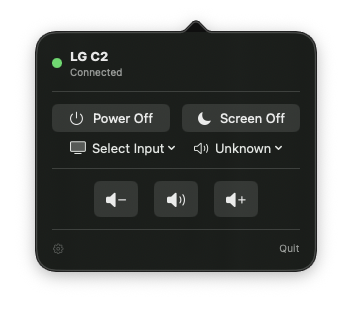
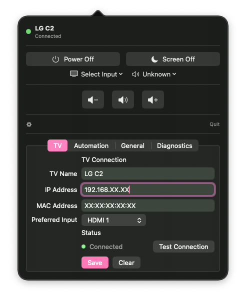
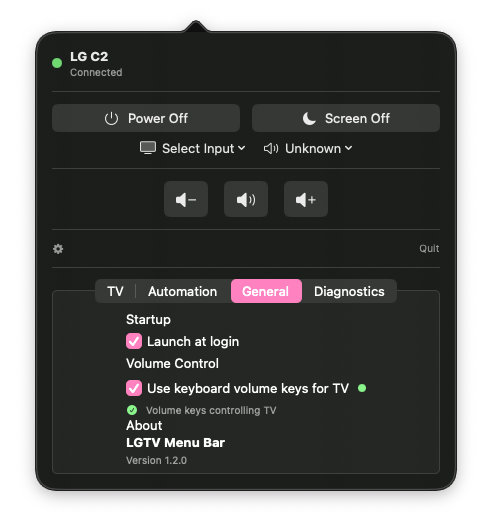
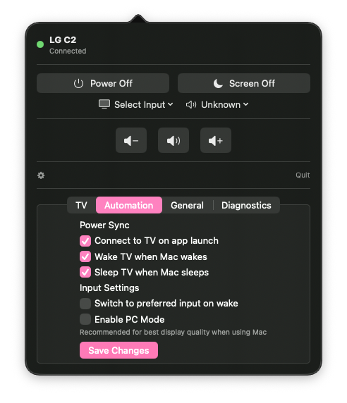
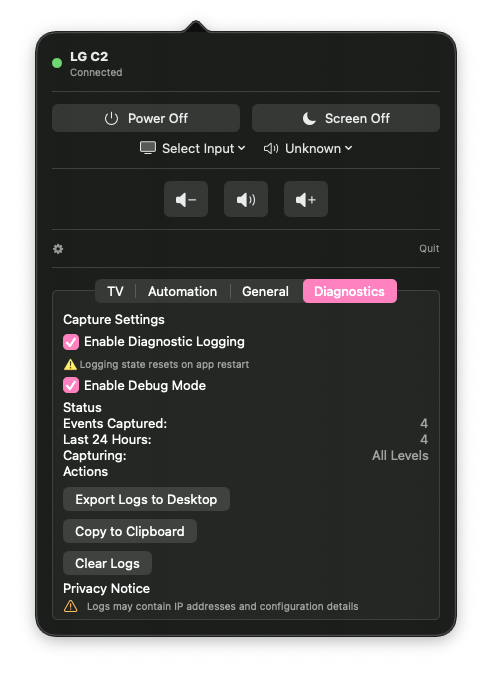

<h1>
   LGTVMenuBar
</h1>

A native macOS menu bar app for controlling LG WebOS TVs.

## Screenshots

| Menu bar (compact) | Menu bar (expanded) |
| --- | --- |
| <a href="images/menubar-small.png"></a><br><sub>Compact status view</sub> | <a href="images/menubar-expanded.png"></a><br><sub>Expanded controls</sub> |

| General settings | Automation settings | Diagnostics |
| --- | --- | --- |
| <a href="images/general.png"></a><br><sub>Connection and input preferences</sub> | <a href="images/automation.png"></a><br><sub>Wake/sleep and input rules</sub> | <a href="images/diagnostics.png"></a><br><sub>Logging and export tools</sub> |

## Features

- **Wake-on-LAN**: Wake your TV when your Mac wakes
- **Auto Sleep**: Turn off TV when Mac sleeps (skips if watching different input)
- **Volume Control**: Weighted slider with resistance at high volumes
- **Input Switching**: Quick switch between HDMI, DisplayPort, USB-C inputs
- **Screen Control**: Turn screen on/off without powering down TV
- **PC Mode**: Auto-detect and set PC mode for reduced input lag
- **Media Keys**: Capture volume keys to control TV volume
- **Onboarding**: First-run setup wizard

## Requirements

- macOS 15.0+
- LG WebOS TV (2018 or newer recommended)
- TV and Mac on the same network

## Building

```bash
# Build the project
swift build

# Run tests
swift test

# Build release DMG
./scripts/build-dmg.sh
```

## Installation

1. Download the latest DMG from Releases
2. Open the DMG and drag LGTVMenuBar to Applications
3. Launch LGTVMenuBar
4. Follow the onboarding wizard to connect your TV
5. Grant Accessibility permission when prompted (for media key capture)

## First Launch (Security Warning)

Since this app is distributed outside the Mac App Store and uses ad-hoc code signing, macOS Gatekeeper will block it on first launch with a message: **"LGTVMenuBar cannot be opened because the developer cannot be verified."**

To open the app:

1. **Right-click** (or Control-click) on LGTVMenuBar in Applications
2. Select **Open** from the context menu
3. Click **Open** in the dialog that appears

You only need to do this once—subsequent launches work normally.

### Why does this happen?

This app is signed but not notarized with Apple (which requires a paid Developer account). The source code is fully available in this repository, and you can [build it yourself](#building) if you prefer.

## Configuration

On first launch, the onboarding wizard will guide you through:

1. **TV Discovery**: Enter your TV's IP address and MAC address
2. **TV Pairing**: Accept the pairing prompt on your TV
3. **Preferences**: Configure wake/sleep behavior and preferred input
4. **Permissions**: Grant necessary system permissions

## Architecture

- **Swift 6.0** with strict concurrency
- **SwiftUI** for the menu bar popover UI
- **WebSocket** communication with LG WebOS API
- **Keychain** for secure pairing key storage

## Project Structure

```
Sources/LGTVMenuBar/
├── Models/          # Data models and enums
├── Protocols/       # Protocol definitions
├── Services/        # Business logic and API clients
└── Views/           # SwiftUI views

Tests/LGTVMenuBarTests/
├── Mocks/           # Mock implementations for testing
├── Services/        # Service integration tests
└── Unit/            # Unit tests
```

## License

MIT License - see [LICENSE](LICENSE) for details.
